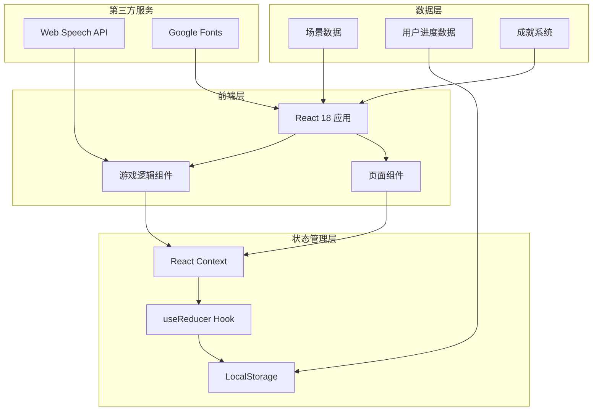

# 英语场景闯关小游戏 - 技术架构文档

## 1. 架构设计



**架构说明:**

- 采用 React 18 单页应用架构
- 使用 Context API 进行全局状态管理
- 组件化设计,每个场景独立封装
- LocalStorage 持久化用户数据
- Web Speech API 实现语音合成

## 2. 技术栈

- **前端框架**:React 18.2 + TypeScript 5
- **构建工具**:Vite 5
- **样式方案**:Tailwind CSS 3.4
- **动画库**:Framer Motion 11
- **状态管理**:React Context + useReducer
- **数据持久化**:LocalStorage API
- **语音合成**:Web Speech API
- **图标库**:Emoji Icons + Lucide React
- **字体**:Google Fonts (Poppins, Inter)

## 3. 路由定义

| 路由路径 | 页面组件 | 功能描述 |
|---------|----------|----------|
| `/` | HomePage | 首页,场景选择 |
| `/scene/:sceneId` | ScenePage | 场景详情和难度选择 |
| `/game/:sceneId/:difficulty` | GamePage | 游戏主页面 |
| `/result/:sceneId` | ResultPage | 闯关结果展示 |
| `/achievements` | AchievementsPage | 成就徽章展示 |

## 4. 组件架构

```
src/
├── components/
│   ├── layout/
│   │   ├── Header.tsx          # 顶部导航栏
│   │   └── Footer.tsx         # 底部(可选)
│   ├── scene/
│   │   ├── SceneCard.tsx      # 场景卡片组件
│   │   ├── DifficultySelect.tsx # 难度选择组件
│   │   └── SceneBackground.tsx # 场景背景装饰
│   ├── game/
│   │   ├── DialogueBox.tsx    # 对话气泡组件
│   │   ├── OptionButton.tsx    # 选项按钮组件
│   │   ├── Timer.tsx           # 计时器组件
│   │   ├── ScoreDisplay.tsx    # 分数显示组件
│   │   └── HintButton.tsx      # 提示按钮组件
│   ├── result/
│   │   ├── StarsAnimation.tsx # 星星动画组件
│   │   ├── ScoreCard.tsx      # 成绩卡片组件
│   │   └── ActionButtons.tsx  # 操作按钮组
│   └── common/
│       ├── Button.tsx          # 通用按钮组件
│       ├── Card.tsx            # 卡片组件
│       ├── Modal.tsx           # 模态框组件
│       └── ProgressBar.tsx     # 进度条组件
├── pages/
│   ├── HomePage.tsx
│   ├── ScenePage.tsx
│   ├── GamePage.tsx
│   ├── ResultPage.tsx
│   └── AchievementsPage.tsx
├── context/
│   ├── GameContext.tsx        # 游戏状态管理
│   └── UserContext.tsx        # 用户数据管理
├── data/
│   ├── scenes.ts              # 场景数据
│   └── achievements.ts        # 成就数据
├── hooks/
│   ├── useGame.ts             # 游戏逻辑Hook
│   ├── useSpeech.ts           # 语音合成Hook
│   └── useLocalStorage.ts     # 本地存储Hook
├── types/
│   └── index.ts               # TypeScript类型定义
├── utils/
│   ├── gameLogic.ts           # 游戏逻辑工具
│   └── storage.ts             # 存储工具
├── styles/
│   └── index.css              # 全局样式
├── App.tsx
└── main.tsx
```

## 5. 数据模型

### 5.1 场景数据模型

```typescript
interface Scene {
  id: string;
  name: string;
  emoji: string;
  description: string;
  backgroundColor: string;
  levels: Level[];
}

interface Level {
  difficulty: 'easy' | 'medium' | 'hard';
  difficultyLabel: string;
  questions: Question[];
  unlocked: boolean;
  stars: number;
}

interface Question {
  id: string;
  npcName: string;
  npcEmoji: string;
  dialogue: string;
  context: string;
  options: string[];
  correctAnswer: number;
  hint?: string;
  explanation?: string;
}
```

### 5.2 用户数据模型

```typescript
interface UserProgress {
  totalStars: number;
  completedScenes: string[];
  sceneProgress: {
    [sceneId: string]: {
      easy: number;
      medium: number;
      hard: number;
    };
  };
  achievements: string[];
  lastPlayed: string;
}
```

### 5.3 成就数据模型

```typescript
interface Achievement {
  id: string;
  name: string;
  description: string;
  emoji: string;
  condition: (progress: UserProgress) => boolean;
  unlocked: boolean;
}
```

## 6. 核心逻辑实现

### 6.1 游戏状态机

```typescript
type GameState = 
  | 'idle'
  | 'playing'
  | 'answering'
  | 'feedback'
  | 'completed';

interface GameContextType {
  state: GameState;
  currentQuestion: number;
  score: number;
  startGame: () => void;
  submitAnswer: (answer: number) => void;
  nextQuestion: () => void;
  completeGame: () => void;
}
```

### 6.2 评分算法

```typescript
function calculateStars(score: number, total: number): number {
  const percentage = (score / total) * 100;
  if (percentage >= 90) return 3;
  if (percentage >= 80) return 2;
  if (percentage >= 60) return 1;
  return 0;
}
```

### 6.3 场景解锁逻辑

```typescript
function isSceneUnlocked(
  sceneId: string,
  progress: UserProgress
): boolean {
  const sceneOrder = ['restaurant', 'airport', 'hotel', 'shopping', 'directions'];
  const sceneIndex = sceneOrder.indexOf(sceneId);
  
  if (sceneIndex === 0) return true;
  
  const previousSceneId = sceneOrder[sceneIndex - 1];
  const previousProgress = progress.sceneProgress[previousSceneId];
  
  return previousProgress?.easy?.stars >= 1;
}
```

## 7. 存储策略

### 7.1 LocalStorage 结构

```typescript
const STORAGE_KEYS = {
  USER_PROGRESS: 'english-game-progress',
  SETTINGS: 'english-game-settings',
  SOUND_ENABLED: 'sound-enabled',
};

// 数据格式
{
  "english-game-progress": {
    "totalStars": 12,
    "completedScenes": ["restaurant", "airport"],
    "sceneProgress": {
      "restaurant": {
        "easy": {" stars": 3, "completed": true },
        "medium": {" stars": 2, "completed": true },
        "hard": {" stars": 0, "completed": false }
      }
    },
    "achievements": ["first-win", "perfect-score"],
    "lastPlayed": "2024-01-15T10:30:00Z"
  }
}
```

## 8. 性能优化策略

1. **代码分割**:使用 React.lazy 进行路由级别代码分割
2. **图片优化**:使用 emoji 作为图标,减少资源请求
3. **状态优化**:使用 useMemo 和 useCallback 减少不必要的渲染
4. **动画优化**:使用 CSS transform 和 opacity,启用 GPU 加速
5. **数据缓存**:场景数据使用 useMemo 缓存,避免重复计算

## 9. 语音功能实现

```typescript
const useSpeech = () => {
  const speak = (text: string) => {
    if ('speechSynthesis' in window) {
      const utterance = new SpeechSynthesisUtterance(text);
      utterance.lang = 'en-US';
      utterance.rate = 0.9;
      utterance.pitch = 1.1;
      speechSynthesis.speak(utterance);
    }
  };

  return { speak };
};
```

## 10. 项目初始化命令

```bash
# 创建 React + TypeScript 项目
npm create vite@latest english-game -- --template react-ts

# 安装依赖
npm install

# 安装 Tailwind CSS
npm install -D tailwindcss postcss autoprefixer
npx tailwindcss init -p

# 安装 Framer Motion
npm install framer-motion

# 安装 Lucide Icons
npm install lucide-react

# 启动开发服务器
npm run dev
```

## 11. 验收标准

- ✓ 所有 5 个场景可正常切换
- ✓ 每个场景包含 3 个难度等级
- ✓ 每个难度包含至少 5 道题目
- ✓ 正确答案显示绿色反馈和动画
- ✓ 错误答案显示红色抖动和正确答案
- ✓ 星星评分系统正常工作
- ✓ LocalStorage 正确保存和读取进度
- ✓ 页面切换动画流畅
- ✓ 响应式布局在移动端正常显示
- ✓ 语音合成功能可正常播放英文
- ✓ 无控制台错误
